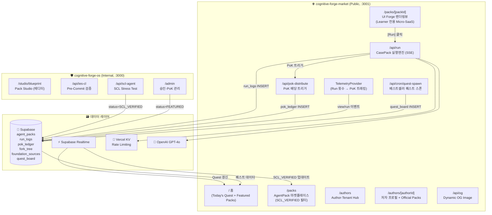
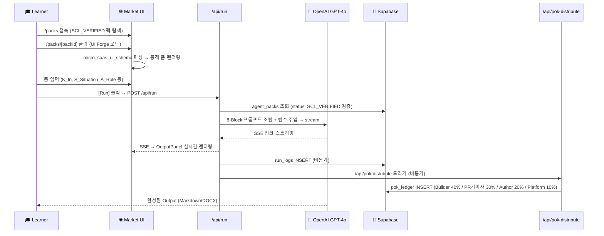

# SDD-01: Architecture Overview
## cognitive-forge-market

**버전:** 1.0 | **날짜:** 2026-04-17

---

## 1. phalanx-media → cognitive-forge-market 컴포넌트 매핑

| phalanx-media 원본 | cognitive-forge-market 대응 | 재활용 방식 |
|:---|:---|:---|
| `/canon` 목록 페이지 | `/packs` 마켓플레이스 | Fork + Supabase 쿼리 교체 |
| `/canon/[chapterId]` 상세 | `/packs/[packId]` 상세 + 실행뷰 | Fork + UI Forge 렌더러 추가 |
| `/experts` 로스터 | `/authors` Author-Tenant Hub | Fork + BaaS 수익 패널 추가 |
| `/experts/[expertId]` | `/authors/[authorId]` | Fork + 팩 목록 추가 |
| `/api/og` | `/api/og` (Pack/Author 전용 확장) | 직접 이식 |
| `TelemetryProvider` | `TelemetryProvider` (Run 이벤트 추가) | 직접 이식 |
| *(없음)* | `/api/run` | 🆕 신규 구현 |
| *(없음)* | `/api/pok-distribute` | 🆕 신규 구현 |
| *(없음)* | `/api/cron/quest-spawn` | 🆕 신규 구현 |
| *(없음)* | `UIForgeRenderer` 컴포넌트 | 🆕 신규 구현 |

---

## 2. 전체 시스템 아키텍처

---

## 3. Learner 실행 전주기 플로우

---

## 4. 라우트 전체 목록

| 라우트 | 타입 | 설명 |
|:---|:---:|:---|
| `/` | Page (SC) | 홈: Today's Quest + Featured Packs |
| `/packs` | Page (SC) | 마켓 리스트 (필터/정렬) |
| `/packs/[packId]` | Page (SC+CC) | UI Forge 렌더링 + Run |
| `/authors` | Page (SC) | Author-Tenant 로스터 |
| `/authors/[authorId]` | Page (SC) | 저자 프로필 + Official Packs |
| `/api/run` | Route Handler | CasePack 실행 (SSE) |
| `/api/pok-distribute` | Route Handler | PoK 배당 (Internal) |
| `/api/og` | Route Handler | Dynamic OG Image (Edge) |
| `/api/cron/quest-spawn` | Route Handler | 퀘스트 스폰 (Cron) |

> SC = Server Component, CC = Client Component

---

## 5. 인프라 스펙

| 서비스 | 플랫폼 | 예상 도메인 |
|:---|:---|:---|
| `cognitive-forge-market` | Vercel Edge | `market.cognitiveforge.io` |
| Supabase | Supabase Cloud | 기존 phalanx-os와 동일 프로젝트 또는 신규 |
| OpenAI | OpenAI API | GPT-4o |
| Rate Limit | Vercel KV | Learner IP 기준 분당 10회 |
