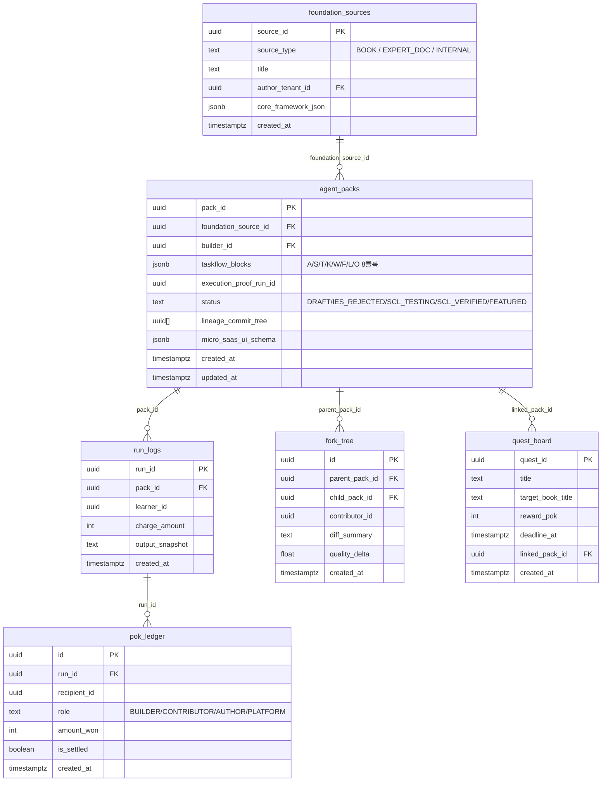

# SDD-02: Database Schema & RLS Policies
## cognitive-forge-market

**버전:** 1.0 | **날짜:** 2026-04-17

---

## 1. ERD 전체 개요



---

## 2. 마이그레이션 SQL

### 001_cognitive_forge_market_init.sql

```sql
-- foundation_sources: 지식 소스 원본
CREATE TABLE foundation_sources (
  source_id UUID PRIMARY KEY DEFAULT gen_random_uuid(),
  source_type TEXT NOT NULL CHECK (source_type IN ('BOOK', 'EXPERT_DOC', 'INTERNAL')),
  title TEXT NOT NULL,
  author_tenant_id UUID REFERENCES auth.users(id) ON DELETE SET NULL,
  core_framework_json JSONB,
  created_at TIMESTAMPTZ DEFAULT now()
);

-- agent_packs: AgentPack 핵심 자산
CREATE TABLE agent_packs (
  pack_id UUID PRIMARY KEY DEFAULT gen_random_uuid(),
  foundation_source_id UUID REFERENCES foundation_sources(source_id) ON DELETE SET NULL,
  builder_id UUID NOT NULL REFERENCES auth.users(id) ON DELETE CASCADE,
  taskflow_blocks JSONB NOT NULL,
  execution_proof_run_id UUID,
  status TEXT NOT NULL DEFAULT 'DRAFT'
    CHECK (status IN ('DRAFT','IES_REJECTED','SCL_TESTING','SCL_VERIFIED','FEATURED')),
  lineage_commit_tree UUID[],
  micro_saas_ui_schema JSONB,
  run_count INT DEFAULT 0,
  created_at TIMESTAMPTZ DEFAULT now(),
  updated_at TIMESTAMPTZ DEFAULT now()
);

-- run_logs: Pack 실행 로그
CREATE TABLE run_logs (
  run_id UUID PRIMARY KEY DEFAULT gen_random_uuid(),
  pack_id UUID NOT NULL REFERENCES agent_packs(pack_id) ON DELETE CASCADE,
  learner_id UUID REFERENCES auth.users(id) ON DELETE SET NULL,
  charge_amount INT DEFAULT 0,
  output_snapshot TEXT,
  created_at TIMESTAMPTZ DEFAULT now()
);

-- pok_ledger: PoK 배당 원장
CREATE TABLE pok_ledger (
  id UUID PRIMARY KEY DEFAULT gen_random_uuid(),
  run_id UUID NOT NULL REFERENCES run_logs(run_id) ON DELETE CASCADE,
  recipient_id UUID NOT NULL REFERENCES auth.users(id) ON DELETE CASCADE,
  role TEXT NOT NULL CHECK (role IN ('BUILDER','CONTRIBUTOR','AUTHOR','PLATFORM')),
  amount_won INT NOT NULL,
  is_settled BOOLEAN DEFAULT false,
  created_at TIMESTAMPTZ DEFAULT now()
);

-- fork_tree: Pack 파생 계보 트리
CREATE TABLE fork_tree (
  id UUID PRIMARY KEY DEFAULT gen_random_uuid(),
  parent_pack_id UUID NOT NULL REFERENCES agent_packs(pack_id) ON DELETE CASCADE,
  child_pack_id UUID NOT NULL REFERENCES agent_packs(pack_id) ON DELETE CASCADE,
  contributor_id UUID REFERENCES auth.users(id) ON DELETE SET NULL,
  diff_summary TEXT,
  quality_delta FLOAT DEFAULT 0.0,
  created_at TIMESTAMPTZ DEFAULT now()
);

-- quest_board: 베스트셀러 연동 퀘스트
CREATE TABLE quest_board (
  quest_id UUID PRIMARY KEY DEFAULT gen_random_uuid(),
  title TEXT NOT NULL,
  target_book_title TEXT,
  reward_pok INT DEFAULT 10000,
  deadline_at TIMESTAMPTZ,
  linked_pack_id UUID REFERENCES agent_packs(pack_id) ON DELETE SET NULL,
  created_at TIMESTAMPTZ DEFAULT now()
);

-- run_count 자동 업데이트 트리거
CREATE OR REPLACE FUNCTION increment_run_count()
RETURNS TRIGGER AS $$
BEGIN
  UPDATE agent_packs SET run_count = run_count + 1 WHERE pack_id = NEW.pack_id;
  RETURN NEW;
END;
$$ LANGUAGE plpgsql;

CREATE TRIGGER trg_increment_run_count
  AFTER INSERT ON run_logs
  FOR EACH ROW EXECUTE FUNCTION increment_run_count();
```

---

## 3. RLS 정책

### 002_rls_policies.sql

```sql
-- === agent_packs RLS ===
ALTER TABLE agent_packs ENABLE ROW LEVEL SECURITY;

-- Learner (비인증 포함): SCL_VERIFIED / FEATURED 팩만 읽기
CREATE POLICY "public_read_verified_packs"
  ON agent_packs FOR SELECT
  USING (status IN ('SCL_VERIFIED', 'FEATURED'));

-- Builder: 본인 팩 CRUD (status=DRAFT 포함)
CREATE POLICY "builder_own_packs"
  ON agent_packs FOR ALL
  USING (builder_id = auth.uid());

-- Service Role: 전체 접근 (IES-CL/SCL 서버 사이드)
-- service role은 RLS 우회하므로 별도 정책 불필요

-- === run_logs RLS ===
ALTER TABLE run_logs ENABLE ROW LEVEL SECURITY;

-- Learner: 본인 실행 기록만 조회
CREATE POLICY "learner_own_runs"
  ON run_logs FOR SELECT
  USING (learner_id = auth.uid());

-- 실행 INSERT는 서버사이드 API (service role) 전용
CREATE POLICY "service_insert_runs"
  ON run_logs FOR INSERT
  WITH CHECK (true); -- service role만 호출하므로 실질 제어는 API에서

-- === pok_ledger RLS ===
ALTER TABLE pok_ledger ENABLE ROW LEVEL SECURITY;

-- 수령인: 본인 배당만 조회
CREATE POLICY "recipient_own_pok"
  ON pok_ledger FOR SELECT
  USING (recipient_id = auth.uid());

-- === fork_tree RLS ===
ALTER TABLE fork_tree ENABLE ROW LEVEL SECURITY;

-- 공개 읽기 (오픈 커밋 그래프)
CREATE POLICY "public_read_fork_tree"
  ON fork_tree FOR SELECT
  USING (true);

-- === foundation_sources RLS ===
ALTER TABLE foundation_sources ENABLE ROW LEVEL SECURITY;

-- 공개 읽기
CREATE POLICY "public_read_sources"
  ON foundation_sources FOR SELECT
  USING (true);

-- Author-Tenant: 본인 소스 관리
CREATE POLICY "author_own_sources"
  ON foundation_sources FOR ALL
  USING (author_tenant_id = auth.uid());

-- === quest_board RLS ===
ALTER TABLE quest_board ENABLE ROW LEVEL SECURITY;

-- 공개 읽기
CREATE POLICY "public_read_quests"
  ON quest_board FOR SELECT
  USING (true);
```

---

## 4. Supabase Realtime 구독 채널

| 채널명 | 테이블 | 이벤트 | 목적 |
|:---|:---|:---|:---|
| `scl-updates` | `agent_packs` | UPDATE (status=SCL_VERIFIED) | 마켓 팩 배지 실시간 갱신 |
| `quest-updates` | `quest_board` | INSERT | 홈 Today's Quest 실시간 갱신 |
| `featured-updates` | `agent_packs` | UPDATE (status=FEATURED) | 홈 Featured 섹션 갱신 |

---

## 5. 타입 정의 (TypeScript)

```typescript
// src/types/database.ts

export type PackStatus = 'DRAFT' | 'IES_REJECTED' | 'SCL_TESTING' | 'SCL_VERIFIED' | 'FEATURED';
export type SourceType = 'BOOK' | 'EXPERT_DOC' | 'INTERNAL';
export type PoKRole = 'BUILDER' | 'CONTRIBUTOR' | 'AUTHOR' | 'PLATFORM';

export interface AgentPack {
  pack_id: string;
  foundation_source_id?: string;
  builder_id: string;
  taskflow_blocks: TaskflowBlocks;
  execution_proof_run_id?: string;
  status: PackStatus;
  lineage_commit_tree?: string[];
  micro_saas_ui_schema?: MicroSaaSUISchema;
  run_count: number;
  created_at: string;
  updated_at: string;
}

export interface TaskflowBlocks {
  A?: string;  // Agent Role
  S?: string;  // Situation
  T?: string;  // Task
  K?: string;  // Knowledge (K-REF)
  W?: string;  // Watchouts
  F?: string;  // Flow (기승전결)
  L?: string;  // Length/Format
  O?: string;  // Output Contract
}

export interface RunLog {
  run_id: string;
  pack_id: string;
  learner_id?: string;
  charge_amount: number;
  output_snapshot?: string;
  created_at: string;
}

export interface PoKLedger {
  id: string;
  run_id: string;
  recipient_id: string;
  role: PoKRole;
  amount_won: number;
  is_settled: boolean;
  created_at: string;
}
```
