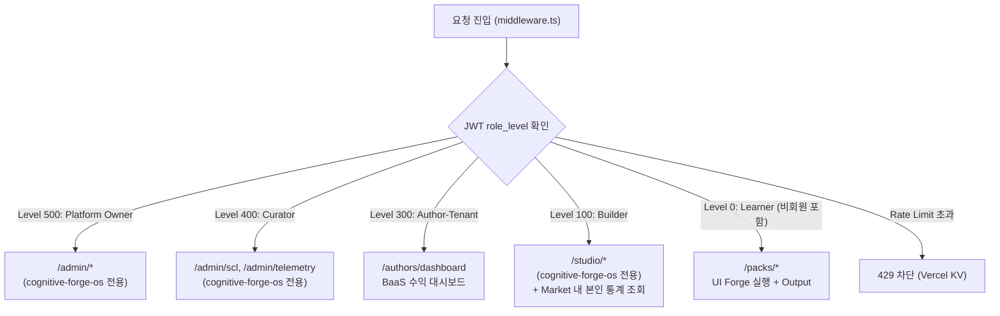

# SDD-03: RBAC & Authentication
## cognitive-forge-market

**버전:** 1.0 | **날짜:** 2026-04-17

---

## 1. RBAC Level 체계



---

## 2. 이 레포 내 RBAC 적용 범위

| Level | 접근 가능 라우트 | 제한 라우트 |
|:---:|:---|:---|
| 0 (Learner) | `/`, `/packs`, `/packs/[packId]`, `/authors`, `/authors/[authorId]` | - |
| 100 (Builder) | + 본인 run_logs, pok_ledger 대시보드 패널 | 타인 데이터 |
| 300 (Author-Tenant) | + `/authors/dashboard` (BaaS 수익 확인) | admin 경로 |
| 400+ | market 내 동일 (admin 기능은 OS 레포에서) | - |

> **이 레포는 관리자 기능이 없습니다.** 승인, SCL 실행, PoK 정산 결정은 전부 `cognitive-forge-os` 담당입니다.

---

## 3. JWT Claim 구조

Supabase Auth + Custom Claims 방식:

```json
{
  "sub": "user-uuid",
  "email": "user@example.com",
  "app_metadata": {
    "role_level": 100,
    "tenant_id": "author-org-uuid",
    "builder_tier": "VERIFIED"
  },
  "user_metadata": {
    "display_name": "홍길동",
    "avatar_url": "https://..."
  }
}
```

`role_level`은 `app_metadata`에 저장 (서버사이드에서만 수정 가능).

---

## 4. middleware.ts 설계

```typescript
// src/middleware.ts
import { createMiddlewareClient } from '@supabase/auth-helpers-nextjs';
import { NextResponse } from 'next/server';
import type { NextRequest } from 'next/server';

// 보호된 라우트와 최소 레벨 정의
const PROTECTED_ROUTES: Record<string, number> = {
  '/authors/dashboard': 300,
  '/api/pok-distribute': 0,  // Internal Secret으로 별도 보호
};

export async function middleware(req: NextRequest) {
  const res = NextResponse.next();
  const supabase = createMiddlewareClient({ req, res });
  const { data: { session } } = await supabase.auth.getSession();

  const pathname = req.nextUrl.pathname;

  // Internal API 보호 (INTERNAL_API_SECRET)
  if (pathname === '/api/pok-distribute') {
    const secret = req.headers.get('x-internal-secret');
    if (secret !== process.env.INTERNAL_API_SECRET) {
      return NextResponse.json({ error: 'Unauthorized' }, { status: 401 });
    }
    return res;
  }

  // RBAC 보호 라우트 확인
  const requiredLevel = Object.entries(PROTECTED_ROUTES)
    .find(([route]) => pathname.startsWith(route))?.[1];

  if (requiredLevel !== undefined && requiredLevel > 0) {
    if (!session) {
      return NextResponse.redirect(new URL('/login', req.url));
    }
    const roleLevel = session.user.app_metadata?.role_level ?? 0;
    if (roleLevel < requiredLevel) {
      return NextResponse.json({ error: 'Forbidden' }, { status: 403 });
    }
  }

  return res;
}

export const config = {
  matcher: ['/authors/dashboard', '/api/pok-distribute'],
};
```

---

## 5. Vercel KV Rate Limiting

`/api/run` 엔드포인트 전용:

```typescript
import { kv } from '@vercel/kv';

const RATE_LIMIT = 10;  // 분당 최대 10회
const WINDOW_SECONDS = 60;

export async function checkRateLimit(identifier: string): Promise<boolean> {
  const key = `rate_limit:run:${identifier}`;
  const count = await kv.incr(key);
  if (count === 1) {
    await kv.expire(key, WINDOW_SECONDS);
  }
  return count <= RATE_LIMIT;
}
```

`identifier`는 Learner userId (로그인 시) 또는 IP 주소 (비회원).

---

## 6. Supabase Auth 설정 체크리스트

- [ ] Supabase Dashboard → Auth → Enable Email + Social (Google, GitHub)
- [ ] `app_metadata.role_level` 기본값 0으로 초기화 (신규 가입자)
- [ ] Builder 레벨 업 (100): OS 어드민에서 수동 또는 자동 승인 후 업데이트
- [ ] Author-Tenant (300): 계약 온보딩 후 어드민이 `app_metadata` 업데이트
