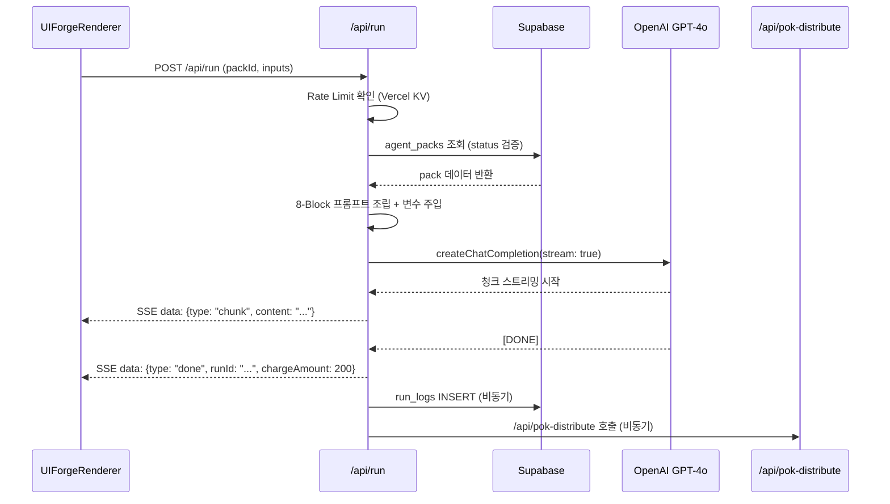

# SDD-06: Pack Run API
## cognitive-forge-market

**버전:** 1.0 | **날짜:** 2026-04-17  
**파일 위치:** `src/app/api/run/route.ts`

---

## 1. 개요

Learner가 UI Forge에서 [Run] 버튼을 클릭하면 호출되는 **핵심 실행 엔진**.  
8-Block JSON을 조립하여 OpenAI GPT-4o에 넘기고, **SSE(Server-Sent Events)** 스트리밍으로 Output을 반환합니다.

**참조 코드:** `phalanx-os/src/app/api/forge-content/route.ts` (구조 유사, 이식 기반)

---

## 2. API 스펙

### Request
```
POST /api/run
Content-Type: multipart/form-data
```

| 필드 | 타입 | 필수 | 설명 |
|:---|:---|:---:|:---|
| `packId` | string (UUID) | ✅ | 실행할 AgentPack ID |
| `inputs` | JSON string | ✅ | `{variable_key: value}` 맵 |
| `learnerId` | string | ➖ | 로그인 사용자 ID (없으면 null) |
| `mcp_context` | string | ➖ | Personal MCP 주입 컨텍스트 |

### Response
```
Content-Type: text/event-stream
Cache-Control: no-cache
Connection: keep-alive
```

**SSE 이벤트 형식:**
```
data: {"type": "chunk", "content": "분석 결과: ..."}

data: {"type": "done", "runId": "uuid", "chargeAmount": 200}

data: {"type": "error", "message": "오류 메시지"}
```

### 에러 응답 (SSE 이전 단계)
| 상태 코드 | 사유 |
|:---:|:---|
| 404 | pack_id 존재하지 않음 |
| 403 | status가 SCL_VERIFIED/FEATURED가 아님 (미검증 팩) |
| 429 | Rate Limit 초과 (Vercel KV) |
| 500 | 내부 서버 오류 / OpenAI API 오류 |

---

## 3. 처리 플로우



---

## 4. 8-Block 프롬프트 조립 로직

```typescript
// src/lib/assemble-prompt.ts

interface TaskflowBlocks {
  A?: string;  // Agent Role (페르소나)
  S?: string;  // Situation (상황)
  T?: string;  // Task (과업)
  K?: string;  // Knowledge / K-REF (핵심 지식)
  W?: string;  // Watchouts (주의사항)
  F?: string;  // Flow (기승전결 구조)
  L?: string;  // Length/Format (출력 형식)
  O?: string;  // Output Contract (출력 계약)
}

export function assembleSystemPrompt(
  blocks: TaskflowBlocks,
  inputs: Record<string, string>
): string {
  // 변수 치환 함수: {variable_key} → inputs 값
  const interpolate = (template: string): string =>
    template.replace(/\{(\w+)\}/g, (_, key) => inputs[key] ?? `[${key}: 미입력]`);

  const sections: string[] = [];

  if (blocks.A) sections.push(`## 역할 (Role)\n${interpolate(blocks.A)}`);
  if (blocks.S) sections.push(`## 상황 (Situation)\n${interpolate(blocks.S)}`);
  if (blocks.T) sections.push(`## 과업 (Task)\n${interpolate(blocks.T)}`);
  if (blocks.K) sections.push(`## 핵심 지식 (Knowledge)\n${interpolate(blocks.K)}`);
  if (blocks.W) sections.push(`## 주의사항 (Watchouts)\n${interpolate(blocks.W)}`);
  if (blocks.F) sections.push(`## 구성 흐름 (Flow)\n${interpolate(blocks.F)}`);
  if (blocks.L) sections.push(`## 출력 형식 (Format)\n${interpolate(blocks.L)}`);
  if (blocks.O) sections.push(`## 출력 계약 (Output Contract)\n${interpolate(blocks.O)}`);

  return sections.join('\n\n');
}

export function assembleUserMessage(inputs: Record<string, string>): string {
  return Object.entries(inputs)
    .filter(([key]) => !['packId', 'learnerId'].includes(key))
    .map(([key, value]) => `[${key}]: ${value}`)
    .join('\n');
}
```

---

## 5. route.ts 전체 구조

```typescript
// src/app/api/run/route.ts
import { NextRequest } from 'next/server';
import { createClient } from '@supabase/supabase-js';
import OpenAI from 'openai';
import { checkRateLimit } from '@/lib/rate-limit';
import { assembleSystemPrompt, assembleUserMessage } from '@/lib/assemble-prompt';

const supabase = createClient(
  process.env.NEXT_PUBLIC_SUPABASE_URL!,
  process.env.SUPABASE_SERVICE_ROLE_KEY!
);
const openai = new OpenAI({ apiKey: process.env.OPENAI_API_KEY });

export async function POST(req: NextRequest) {
  // 1. Rate Limit
  const ip = req.headers.get('x-forwarded-for') ?? 'anonymous';
  const allowed = await checkRateLimit(ip);
  if (!allowed) {
    return new Response(
      `data: ${JSON.stringify({ type: 'error', message: '요청 한도 초과. 1분 후 재시도해주세요.' })}\n\n`,
      { status: 429, headers: { 'Content-Type': 'text/event-stream' } }
    );
  }

  // 2. 입력 파싱
  const formData = await req.formData();
  const packId = formData.get('packId') as string;
  const inputs = JSON.parse(formData.get('inputs') as string);
  const learnerId = formData.get('learnerId') as string | null;
  const mcpContext = formData.get('mcp_context') as string | null;

  // 3. Pack 조회 + 검증
  const { data: pack, error } = await supabase
    .from('agent_packs')
    .select('pack_id, taskflow_blocks, status, foundation_source_id')
    .eq('pack_id', packId)
    .in('status', ['SCL_VERIFIED', 'FEATURED'])
    .single();

  if (error || !pack) {
    return Response.json({ error: '팩을 찾을 수 없거나 검증되지 않은 팩입니다.' }, { status: 404 });
  }

  // 4. SSE 스트리밍 응답 시작
  const encoder = new TextEncoder();
  const stream = new ReadableStream({
    async start(controller) {
      try {
        // 5. 프롬프트 조립
        const systemPrompt = assembleSystemPrompt(pack.taskflow_blocks, inputs);
        const userMessage = assembleUserMessage(inputs);

        // MCP 컨텍스트 주입
        const finalSystem = mcpContext
          ? `[Personal Context]\n${mcpContext}\n\n---\n\n${systemPrompt}`
          : systemPrompt;

        // 6. OpenAI 스트리밍
        const completion = await openai.chat.completions.create({
          model: 'gpt-4o',
          stream: true,
          temperature: 0.4,
          messages: [
            { role: 'system', content: finalSystem },
            { role: 'user', content: userMessage }
          ]
        });

        let fullOutput = '';
        for await (const chunk of completion) {
          const content = chunk.choices[0]?.delta?.content ?? '';
          if (content) {
            fullOutput += content;
            controller.enqueue(
              encoder.encode(`data: ${JSON.stringify({ type: 'chunk', content })}\n\n`)
            );
          }
        }

        // 7. run_logs INSERT (비동기)
        const chargeAmount = 200; // TODO: 과금 정책 연동
        const { data: runLog } = await supabase
          .from('run_logs')
          .insert({ pack_id: packId, learner_id: learnerId, charge_amount: chargeAmount, output_snapshot: fullOutput.slice(0, 500) })
          .select('run_id')
          .single();

        // 8. PoK 트리거 (비동기, fire-and-forget)
        if (runLog && chargeAmount > 0) {
          fetch('/api/pok-distribute', {
            method: 'POST',
            headers: {
              'Content-Type': 'application/json',
              'x-internal-secret': process.env.INTERNAL_API_SECRET!
            },
            body: JSON.stringify({ runId: runLog.run_id, packId, chargeAmount })
          });
        }

        // 9. 완료 이벤트
        controller.enqueue(
          encoder.encode(`data: ${JSON.stringify({ type: 'done', runId: runLog?.run_id, chargeAmount })}\n\n`)
        );
      } catch (err: any) {
        controller.enqueue(
          encoder.encode(`data: ${JSON.stringify({ type: 'error', message: err.message })}\n\n`)
        );
      } finally {
        controller.close();
      }
    }
  });

  return new Response(stream, {
    headers: {
      'Content-Type': 'text/event-stream',
      'Cache-Control': 'no-cache',
      'Connection': 'keep-alive',
    }
  });
}
```

---

## 6. 개발/데모 폴백 (API Key 없을 때)

`phalanx-os/forge-content`와 동일하게, `OPENAI_API_KEY`가 없으면 하드코딩 Mock Output을 SSE로 스트리밍합니다:

```typescript
if (!process.env.OPENAI_API_KEY) {
  const mockChunks = ['[DEMO] ', '분석 결과: ', '이 팩은 SCL 검증 완료된 AgentPack입니다.'];
  for (const chunk of mockChunks) {
    controller.enqueue(encoder.encode(`data: ${JSON.stringify({ type: 'chunk', content: chunk })}\n\n`));
    await new Promise(r => setTimeout(r, 200));
  }
  // done 이벤트 발송
  return;
}
```
