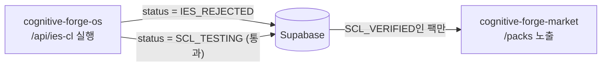
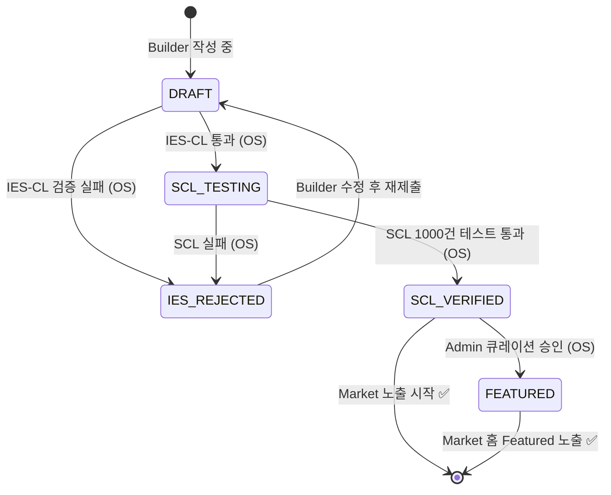

# SDD-07: IES-CL Pipeline (Market 연동 명세)
## cognitive-forge-market

**버전:** 1.0 | **날짜:** 2026-04-17

> ⚠️ **IES-CL 실행 주체는 `cognitive-forge-os`입니다.**  
> 이 문서는 Market이 IES-CL 결과를 어떻게 **소비(Consume)**하는지를 정의합니다.

---

## 1. IES-CL란?

**IES-CL (Integrity & Ethics Screening - Copyright Layer)**:  
Builder가 Pack Studio에서 [Share to Commons]를 클릭하면 `cognitive-forge-os`에서 실행되는 **Pre-Commit Kill-Switch** 파이프라인.

### 4단계 검증
1. **K-REF 저작권 스캔** — K 블록에 원문 복붙 감지 시 즉시 반려
2. **Output Contract 완결성** — O 블록 명세 누락 시 반려
3. **Watchouts 공백 체크** — W 블록 비어있으면 반려
4. **Execution Proof 확인** — `execution_proof_run_id` 존재 필수

---

## 2. Market의 역할: Status 구독만

Market은 IES-CL 로직을 갖지 않습니다. 오직 `agent_packs.status` 필드를 신뢰합니다.



---

## 3. Market 필수 규칙 (절대 규칙)

```typescript
// 이 필터 없이는 팩을 절대 노출하지 말 것
const ALLOWED_STATUSES: PackStatus[] = ['SCL_VERIFIED', 'FEATURED'];

// 모든 팩 조회 쿼리에 반드시 포함
supabase.from('agent_packs').in('status', ALLOWED_STATUSES)
```

- `/packs` 리스트: `WHERE status IN ('SCL_VERIFIED', 'FEATURED')`
- `/packs/[packId]`: 해당 팩이 위 조건 불만족 시 `notFound()` 반환
- `/api/run`: status 검증 실패 시 **403 반환** (IES가 아닌 상태 미달 팩 실행 금지)

---

## 4. IES_REJECTED 팩 처리

Market에서 `IES_REJECTED` 팩은:
- **검색 결과 완전 제외**
- 직접 URL 접근 시 → `notFound()` → 404 페이지
- 에러 메시지: "이 팩은 현재 검토 중입니다."

---

## 5. 상태 전이 다이어그램



**Market이 표시하는 상태:** `SCL_VERIFIED`, `FEATURED` 만.
