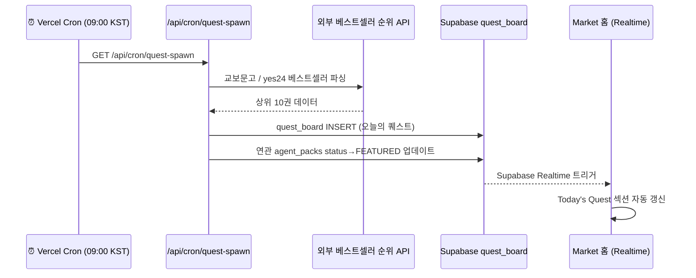

# SDD-12: Cron Quest Spawner
## cognitive-forge-market

**버전:** 1.0 | **날짜:** 2026-04-17  
**파일 위치:** `src/app/api/cron/quest-spawn/route.ts`  
**참조:** `phalanx-os/src/app/api/cron/sometrend/route.ts` (Fork 기반)

---

## 1. 개요

**매일 오전 9시** Vercel Cron이 베스트셀러 순위를 파싱하여  
`quest_board` 테이블에 새 퀘스트를 삽입하고 Market 홈의 **Today's Quest**를 갱신합니다.



---

## 2. Vercel Cron 설정

```json
// vercel.json
{
  "crons": [
    {
      "path": "/api/cron/quest-spawn",
      "schedule": "0 0 * * *"
    }
  ]
}
```
> KST 09:00 = UTC 00:00

---

## 3. route.ts 구조

```typescript
// src/app/api/cron/quest-spawn/route.ts
import { NextRequest } from 'next/server';
import { createClient } from '@supabase/supabase-js';

const supabase = createClient(
  process.env.NEXT_PUBLIC_SUPABASE_URL!,
  process.env.SUPABASE_SERVICE_ROLE_KEY!
);

export async function GET(req: NextRequest) {
  // Vercel Cron 인증
  const authHeader = req.headers.get('authorization');
  if (authHeader !== `Bearer ${process.env.CRON_SECRET}`) {
    return Response.json({ error: 'Unauthorized' }, { status: 401 });
  }

  try {
    // 1. 베스트셀러 순위 파싱
    const bestsellers = await fetchBestsellers();

    // 2. 오늘의 퀘스트 생성 (Top 1 도서 기반)
    const topBook = bestsellers[0];
    const deadline = new Date();
    deadline.setDate(deadline.getDate() + 7);  // 7일 후 마감

    const { data: quest, error } = await supabase
      .from('quest_board')
      .insert({
        title: `📚 "${topBook.title}" 전문 AI 팩을 만들어라!`,
        target_book_title: topBook.title,
        reward_pok: 50000,
        deadline_at: deadline.toISOString(),
      })
      .select('quest_id')
      .single();

    if (error) throw error;

    return Response.json({
      success: true,
      questId: quest.quest_id,
      book: topBook.title,
      message: `퀘스트 생성 완료: ${topBook.title}`
    });

  } catch (err: any) {
    console.error('[quest-spawn] Error:', err);
    return Response.json({ error: err.message }, { status: 500 });
  }
}

// 베스트셀러 파싱 (교보문고 HTML 파싱 예시)
async function fetchBestsellers(): Promise<{ title: string; author: string; rank: number }[]> {
  // Option A: 교보문고 베스트셀러 페이지 HTML 파싱
  // Option B: 알라딘 API (공개 API 존재)
  // Option C: hardcoded fallback (초기 개발용)

  // 개발 단계 fallback
  return [
    { title: '원씽', author: '게리 켈러', rank: 1 },
    { title: '아주 작은 습관의 힘', author: '제임스 클리어', rank: 2 },
  ];
}
```

---

## 4. Today's Quest UI (홈 페이지)

```typescript
// src/components/quest-hero.tsx
'use client';
import { useEffect, useState } from 'react';
import { createClient } from '@/lib/supabase-client';

export function QuestHero() {
  const [quest, setQuest] = useState<QuestBoard | null>(null);
  const supabase = createClient();

  useEffect(() => {
    // 초기 데이터 로드
    fetchCurrentQuest().then(setQuest);

    // Realtime 구독
    const channel = supabase
      .channel('quest-updates')
      .on('postgres_changes', {
        event: 'INSERT',
        schema: 'public',
        table: 'quest_board'
      }, (payload) => {
        setQuest(payload.new as QuestBoard);
      })
      .subscribe();

    return () => { supabase.removeChannel(channel); };
  }, []);

  if (!quest) return <QuestHeroSkeleton />;

  return (
    <div className="quest-hero">
      <div className="quest-hero__badge">🔥 Today's Quest</div>
      <h2 className="quest-hero__title">{quest.title}</h2>
      <div className="quest-hero__meta">
        <span>🎯 {quest.target_book_title}</span>
        <span>⏰ <QuestCountdown deadline={quest.deadline_at} /></span>
        <span>💎 {quest.reward_pok.toLocaleString()} PoK</span>
      </div>
      <a href="/studio/blueprint" className="quest-hero__cta">
        팩 만들러 가기 →
      </a>
    </div>
  );
}
```

---

## 5. quest_board 스키마 (재확인)

```sql
CREATE TABLE quest_board (
  quest_id UUID PRIMARY KEY DEFAULT gen_random_uuid(),
  title TEXT NOT NULL,
  target_book_title TEXT,
  reward_pok INT DEFAULT 10000,
  deadline_at TIMESTAMPTZ,
  linked_pack_id UUID REFERENCES agent_packs(pack_id) ON DELETE SET NULL,
  created_at TIMESTAMPTZ DEFAULT now()
);

-- RLS: 공개 읽기
ALTER TABLE quest_board ENABLE ROW LEVEL SECURITY;
CREATE POLICY "public_read_quests" ON quest_board FOR SELECT USING (true);
```
