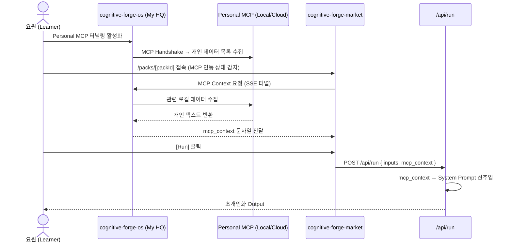

# SDD-13: Personal MCP Bridge
## cognitive-forge-market

**버전:** 1.0 | **날짜:** 2026-04-17  
**참조:** `SDD_Personal_MCP_Integration.md` (cognitive-forge-os/docs)

---

## 1. 개요

**Personal MCP Bridge**는 Learner(= Vanguard 요원)가  
`cognitive-forge-os`에서 활성화한 Personal MCP 세션의 컨텍스트를  
Market의 Pack 실행 시 **선택적으로 주입**하는 연결 레이어입니다.



---

## 2. Market 관점 구현 명세

### 2.1 MCP 연동 상태 감지

Market은 OS로부터 MCP 활성화 여부를 쿠키/헤더로 수신합니다.

```typescript
// src/lib/mcp-bridge.ts

export async function getMCPContext(packId: string): Promise<string | null> {
  // OS가 설정한 MCP 세션 토큰 확인
  const mcpToken = cookies().get('mcp_session_token')?.value;
  if (!mcpToken) return null;

  try {
    // OS의 MCP 프록시 API 호출
    const res = await fetch(`${process.env.FORGE_OS_URL}/api/mcp-context`, {
      method: 'POST',
      headers: {
        'Content-Type': 'application/json',
        'Authorization': `Bearer ${mcpToken}`
      },
      body: JSON.stringify({ packId }),
      next: { revalidate: 0 }  // 항상 fresh
    });

    if (!res.ok) return null;
    const { context } = await res.json();
    return context as string | null;
  } catch {
    return null;  // MCP 없어도 정상 실행
  }
}
```

### 2.2 UIForgeRenderer에서 MCP 사용

```typescript
// src/app/packs/[packId]/page.tsx (Server Component)
import { getMCPContext } from '@/lib/mcp-bridge';

export default async function PackDetailPage({ params }) {
  const pack = await getPackById(params.packId);
  const mcpContext = await getMCPContext(params.packId);  // null이면 일반 모드

  return (
    <PackDetailLayout pack={pack}>
      {/* MCP 활성화 배너 */}
      {mcpContext && (
        <MCPActiveBanner message="Personal MCP 연동됨 — 개인화 컨텍스트가 주입됩니다" />
      )}
      <UIForgeRenderer
        schema={pack.micro_saas_ui_schema}
        packId={pack.pack_id}
        mcpContext={mcpContext ?? undefined}
      />
    </PackDetailLayout>
  );
}
```

### 2.3 /api/run에서 MCP Context 처리 (SDD-06 연동)

```typescript
// /api/run/route.ts 내부 (기존 SDD-06 코드 확장)
const finalSystem = mcpContext
  ? `[Personal MCP Context — 개인 로컬 데이터 주입됨]\n${mcpContext}\n\n---\n\n${systemPrompt}`
  : systemPrompt;
```

---

## 3. 환경 변수 추가

```
FORGE_OS_URL=http://localhost:3000   # dev
# 프로덕션: https://ops.cognitiveforge.io
```

---

## 4. 보안 원칙

SDD_Personal_MCP_Integration.md에서 확립된 원칙 준수:

- **개인 데이터는 Market DB에 저장하지 않음**: mcp_context는 Run 시점 임시 주입 후 폐기
- **run_logs.output_snapshot**: MCP 컨텍스트 원문은 저장하지 않음 (결과물만 일부 저장)
- **쿠키 기반 세션 토큰**: `HttpOnly`, `Secure`, `SameSite=Strict`

---

## 5. 개발 단계 Mock

MCP 서버가 없는 개발 환경에서는 `MOCK_MCP_CONTEXT` 환경변수로 가짜 컨텍스트 주입:

```typescript
// src/lib/mcp-bridge.ts
if (process.env.NODE_ENV === 'development' && process.env.MOCK_MCP_CONTEXT) {
  return process.env.MOCK_MCP_CONTEXT;
}
```

```
# .env.local
MOCK_MCP_CONTEXT="지난주 팀 미팅에서 계약서 해제 조항이 가장 큰 리스크로 논의됨. 특히 3조 2항."
```
